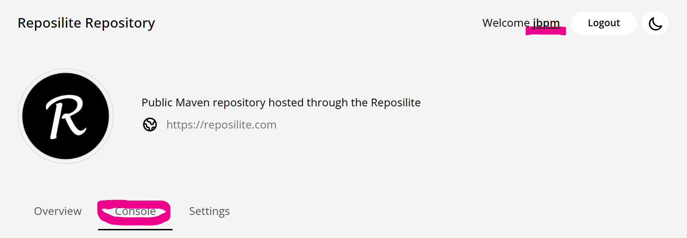

# Servidores
## Funcionalidad
Estos ficheros permitirán levantar los servidores necesarios para el desarrollo de soluciones jbpm en contenedores docker

Facilita al desarrollador la gestión de los siguientes servicios de soporte:
* Hapi fhir para la gestión de recursos sanitarios (localhost:8888)
* Reposilite para la gestión de artefactos (localhost:8081)
* Business Central para la edición de proyectos (kjar) y como controlador de motores kie externos. Usado principalmente para depurar y validar desarrollos jbpm (localhost:8080/business-central)

Usar el comando ``docker compose up -d`` para arrancar los tres contenedores y montar los volúmenes de configuración inical

### Servidor fhir
Estará disponible en el puerto 8888 de la máquina host

Backend para la persistencia de la información clínica

Se configura con el fichero application.yaml. 
La configuración inicial esta preparada para que se utilice la versión FHIR R5 y para que el servidor esté disponible en el puerto 8888

### Servidor [Reposilite](https://reposilite.com/)
El servidor de artefactos maven estará disponible en el puerto 8081 de la máquina host

Las soluciones kie constan de distintos componentes interdependientes. La gestión de dependencias se hace mediante artefactos disponibles en repositorios maven. Este repositorio está ideado para utilizar como repositorio de artefactos un servidor Reposilite local, que será el servidor de artefactos maven compartido entre business Central y las aplicaciones kie (jBPM) desarrolladas. Será necesario que la configuración maven del entorno de desarrollo tenga en cuenta este repositorio para localizar artefactos, y a su vez, que business central publique en el mismo los artefactos construidos (bases de conocimiento, kjar).

Se configura con el fichero .env y el volumen reposilite-data (directorio).

La configuración inicial incluye un token temporal (``manager:+0bvABRzaA3Owc+t1/rgq7QmCQbUrh1+ib50QIrJ56jbncMhwXNwy/AJWktRxmPJ``) y un token persistente (``jbpm:Qkjbf2gGjBIIufQJD79K0Js7KLlINal2l4AmchNJ74HUP67NRBfmgaL+c7hpET+q``) para el acceso.

Podrá acceder a la consola de gestión de Reposilite si se autentica con cualquiera de estos dos usuarios (jbpm o manager).


Para consultar las opciones introducir el comando help en la consola.
Es recomendable crear tokens nuevos para su entorno. En la imagen se presenta la ejecución del comando token-create usado para crear el token jbpm.


Además se ha creado el repositorio kie (aunque no resulta imprescindible). La creación de nuevos repositorios se hace en Settings.


También está disponible el fichero json [tokensIni](./resources/tokensIni) que contiene los dos tokens iniciales, por si fuera necesario importarlos a otro entorno.

En el entorno de desarrollo local será necesario configurar el fichero settings del usuario (desarrollador) para que tenga acceso a este repositorio (se puede usar el settings de business central como referencia. Es recomendable crear un token nuevo para el desarrollador).

Las bases de conocimiento (proyectos kjar) en desarrollo deben incluir en su fichero ``pom.xml`` el reposilite local, para que business central los publique aquí.

```xml
<distributionManagement>
	<repository>
		<id>reposilite-kie</id>
		<url>http://reposilite:8081/kie</url>
		<layout>default</layout>
	</repository>
</distributionManagement>
```

### Servidor Business Central (BC)
Estará disponible en el puerto 8080 de la máquina host

Servidor para el control del motor kie de la aplicación en modo development. Permite desplegar contenedores en el motor (modificando procesos si es necesario), ejecutar tareas humanas, etc... desde BC en caliente, es decir, sin necesidad de reiniciar la aplicación.

Además permite la creación y edición de proyectos (conjunto de activos o kjar).

La configuración inicial realizada se hace a través de los ficheros standalone.xml y settings.xml. 
Básicamente se configuran las credenciales de business-central para poder publicar artefactos en el repositorio local reposilite.

Es necesario tener en cuenta que para que este servidor pueda controlar servidores kie externos, corriendo en la máquina host,
cuando estos se registren tienen que indicar la dirección de su interfaz de control usando host.docker.internal, en lugar de localhost.
Por ejemplo, si el servidor kie está corriendo en el puerto 8090 de la máquina host debe registrarse en el business central del contenedor como
``kieserver.location=http://host.docker.internal:8090/rest/server``
